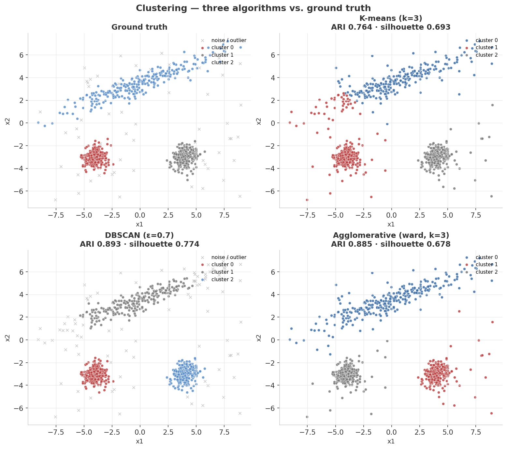
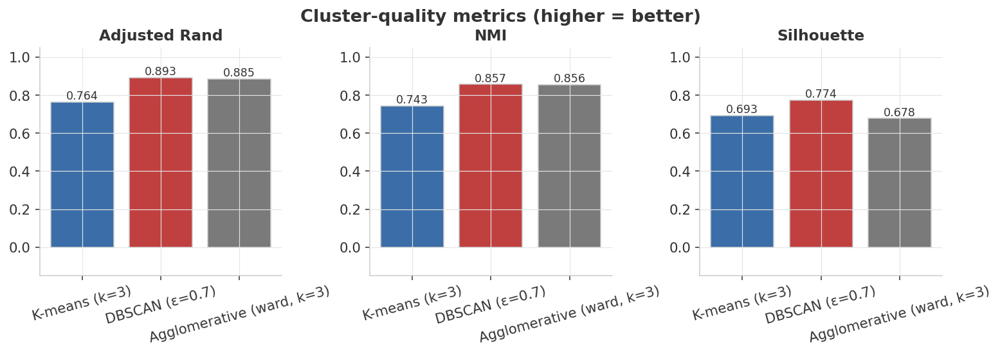
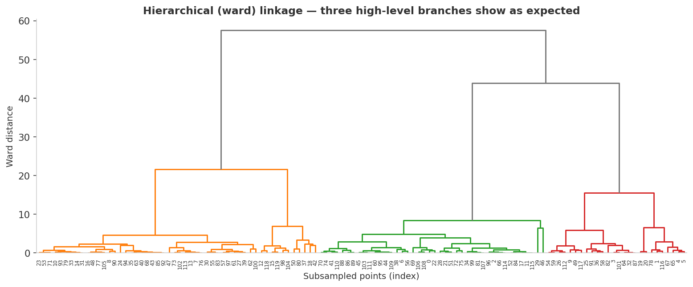

<div align="center">

# Clustering — Three Algorithms vs. Synthetic Ground Truth

**K-means · DBSCAN · Agglomerative · on a deliberately tricky synthetic dataset**


</div>

---

## At a glance

> Cluster a 2-D dataset that mixes two round Gaussian blobs, one **elongated anisotropic blob** that breaks K-means' equal-axis assumption, and a sparse band of **uniform-noise outliers**. Score against the ground-truth labels with Adjusted Rand Index — a luxury real unsupervised tasks don't give you.

<table>
<tr>
<td align="center" width="33%">
<sub>K-means (k=3)</sub><br>
<b style="font-size:1.5em; color:#7A7A7A;">ARI 0.764</b><br>
<sub>shears the elongated cluster</sub>
</td>
<td align="center" width="33%">
<sub>DBSCAN (ε=0.7)</sub><br>
<b style="font-size:1.5em; color:#3B6EA8;">ARI 0.893</b><br>
<sub>+ correctly flags 89 outliers</sub>
</td>
<td align="center" width="33%">
<sub>Agglomerative (ward)</sub><br>
<b style="font-size:1.5em; color:#3B6EA8;">ARI 0.885</b><br>
<sub>but absorbs noise into clusters</sub>
</td>
</tr>
</table>

| Algorithm | Clusters found | Noise flagged | ARI | NMI | Silhouette |
|---|:---:|:---:|---:|---:|---:|
| K-means (k=3) | 3 | 0 | 0.764 | 0.743 | **0.693** |
| **DBSCAN (ε=0.7, min_samples=10)** | **3** | **89** | **0.893** | **0.857** | **0.774** |
| Agglomerative (ward, k=3) | 3 | 0 | 0.885 | 0.856 | 0.678 |

<sub>**Headline finding:** the elongated cluster reveals each algorithm's bias. K-means commits to spherical clusters and slices the long blob in two; DBSCAN follows the actual density and additionally separates the uniform-noise band as outliers; Agglomerative gets the partition right but, like K-means, has no concept of "noise" so it forces the outliers into one of the three clusters.</sub>

---

## Experimental setup

Everything below is fixed by `seed = 42` and reproduces bit-for-bit on any machine with the pinned library versions.

### Data-generating process

The dataset is fully synthetic — three structurally distinct 2-D clusters plus a uniform-noise band, generated by `generate_data.py` with `numpy.random.default_rng(42)`:

1. **Cluster 0 — round blob.** `n=250` points from $\mathcal{N}(\mu=[-4, -3],\, \sigma=0.55)$ (isotropic). K-means is comfortable here.
2. **Cluster 1 — round blob.** `n=250` points from $\mathcal{N}(\mu=[4, -3],\, \sigma=0.55)$ (isotropic). K-means is comfortable here too.
3. **Cluster 2 — elongated anisotropic blob.** `n=250` base points drawn from $\mathcal{N}(0,1)$, then axis-stretched to a **~7:1 aspect ratio** ($\sigma_x = 3.5$, $\sigma_y = 0.45$), rotated **20 °** counter-clockwise, and translated to centroid $[0, 3.5]$. This deliberately breaks K-means' isotropic-variance assumption.
4. **Uniform noise band.** `n=60` points drawn uniformly from the bounding box $[-9, 9] \times [-7, 7]$, labelled $-1$. These are the true outliers DBSCAN is expected to isolate.
5. **Permutation.** All 810 points are shuffled with the same RNG before saving, so row order carries no information.

Total dataset size: **810 points** (750 cluster + 60 noise).

| Parameter | Value | Why it's set this way |
|---|---|---|
| `n_per_cluster` | 250 | Enough points for all three algorithms to find stable solutions; small enough for fast runs. |
| `n_noise` | 60 | ~7.4 % of the dataset — realistic low-contamination scenario. Too many and DBSCAN's ε choice becomes degenerate. |
| `anisotropy` | 3.5× / 0.45× + 20° rotation | Forces a ~7:1 aspect ratio on cluster 2, enough to split under K-means' equal-axis assumption while still visually identifiable as one cluster. |
| `seed` | 42 | Controls the full RNG — feature draws, noise draws, and the final permutation — so the exact 810-point matrix is deterministic. |

### Preprocessing

**No scaling is applied.** All three algorithms receive raw 2-D coordinates. This is intentional: the clusters were constructed with coordinates in the same approximate range ($x \in [-9, 9]$, $y \in [-7, 7]$) so the axes are already commensurable. In practice, distance-based methods (K-means, DBSCAN) are sensitive to feature scale — if one feature were in [0, 1000] and the other in [0, 1], `StandardScaler` would be essential before computing Euclidean distances. Here the generator's controlled range removes that confound, keeping the axis-shape bias of each algorithm as the single variable under study.

### Algorithms & hyperparameters

| Algorithm | Scikit-learn class | Key hyperparameters | Notes |
|---|---|---|---|
| K-means | `KMeans` | `n_clusters=3`, `n_init=10`, `random_state=42` | `n_init=10` runs 10 random initializations and keeps the best inertia — mitigates k-means++ seed sensitivity. |
| DBSCAN | `DBSCAN` | `eps=0.7`, `min_samples=10` | ε chosen so the two round blobs are clearly denser than the noise band; `min_samples=10` requires a true local neighborhood before core-point promotion. |
| Agglomerative | `AgglomerativeClustering` | `n_clusters=3`, `linkage="ward"` | Ward linkage minimizes within-cluster variance at each merge — the hierarchical analogue of K-means' objective. |

### Environment

`python ≥ 3.10` · `numpy ≥ 1.24` · `pandas ≥ 2.0` · `scikit-learn ≥ 1.3` · `scipy ≥ 1.10` · `matplotlib ≥ 3.7`

---

## Dashboard

### 1. Side-by-side panels — ground truth vs. each algorithm



The top-left panel is what an oracle would output. The other three are what each algorithm comes up with from the same input points.

- **K-means** treats every cluster as if it were a sphere. It fits the two round blobs perfectly, then cuts the elongated cluster down its short axis to balance variance — visible as the abrupt color change in the upper-right panel.
- **DBSCAN** doesn't impose a shape; it follows local density. It recovers all three clusters and additionally tags the sparse points (`x` markers) as noise. Note how the noise count of **89** *exceeds* the 60 we injected — a few low-density edges of the elongated blob also look noise-like to DBSCAN at this ε, which is a true-to-life behavior of the algorithm.
- **Agglomerative (ward linkage)** matches DBSCAN's structural recovery but without the noise concept; the outliers get absorbed into whichever cluster they're closest to, which is why its silhouette is lower despite a comparable ARI.

### 2. Cluster-quality metrics



Three different lenses on "cluster quality":

- **Adjusted Rand Index (ARI)** — agreement with ground truth, corrected for chance. Range [-1, 1]. Highest for DBSCAN.
- **Normalized Mutual Information (NMI)** — information shared between predicted and true labels. Highest for DBSCAN, but Agglomerative is essentially tied.
- **Silhouette** — purely intrinsic, doesn't use ground truth. *Highest for K-means*. That's a paradox worth noticing: K-means scores best on the metric that asks "how compact are my clusters," because it actively *optimizes for* compact spherical clusters — even when the ground truth has a non-spherical one. That's the textbook lesson on why intrinsic metrics alone can be misleading.

### 3. Hierarchical (ward) dendrogram



A subsample of points (120) plotted as a dendrogram with ward linkage. Three high-level branches dominate at the top of the tree — the same three clusters Agglomerative recovers in panel 1. Cutting horizontally at any height in the gray region produces a 3-cluster partition.

---

## Validation methodology

Clustering is fundamentally unsupervised — there are no labels during training. Validation therefore falls into two distinct categories, and conflating them is a common source of confusion.

### Internal metrics (no ground truth required)

These measure the geometry of the partition itself. They can be computed on any dataset, real or synthetic.

| Metric | Definition | Reads as |
|---|---|---|
| **Silhouette** | $s(i) = \frac{b(i) - a(i)}{\max(a(i),\, b(i))}$, averaged over non-noise points | $s \in [-1, 1]$. Near 1: point is well inside its cluster and far from neighbours. Near 0: point is on a boundary. Below 0: probable misassignment. Higher is better. Noise points (label $-1$) are excluded before computing. |
| **Inertia (elbow method)** | $\sum_{i} \lVert x_i - \mu_{c(i)} \rVert_2^2$ | Within-cluster sum of squares. Used to choose `k` by plotting inertia vs. `k` and looking for an "elbow." Not computed explicitly here — `k=3` is taken as given. |

### External metrics (require known ground-truth labels)

These compare the algorithm's partition against the true labels. **They are only possible because the data was generated synthetically** — this is the direct analogue of coefficient recovery in project 01.

| Metric | Definition | Reads as |
|---|---|---|
| **ARI** | $\frac{\text{RI} - \mathbb{E}[\text{RI}]}{\max(\text{RI}) - \mathbb{E}[\text{RI}]}$ | Adjusted Rand Index. Agreement between predicted and true partitions, corrected for chance. Range $[-1, 1]$; 0 = random labelling, 1 = perfect agreement. Negative values are possible but rare. |
| **NMI** | $\frac{I(Y; \hat{Y})}{\sqrt{H(Y) \cdot H(\hat{Y})}}$ | Normalized Mutual Information. Fraction of information shared between true and predicted label distributions. Range $[0, 1]$; 1 = perfect recovery. Insensitive to label permutations (cluster 0 predicted as cluster 2 still scores 1.0 if the partition is correct). |

The synthetic-data advantage is decisive here. With a real dataset you can compute silhouette but not ARI/NMI. With a generated dataset you can compute both — and the gap between them reveals algorithm bias (see "silhouette paradox" in the Dashboard section: K-means scores *highest* on silhouette precisely because it optimizes for the compact, spherical geometry that silhouette rewards, while scoring *lowest* on ARI against the actual ground truth).

### Full results

| Algorithm | k found | Noise flagged | ARI | NMI | Silhouette |
|---|:---:|:---:|---:|---:|---:|
| K-means (k=3) | 3 | 0 | 0.7639 | 0.7433 | 0.6926 |
| **DBSCAN (ε=0.7, min_samples=10)** | **3** | **89** | **0.8926** | **0.8572** | **0.7736** |
| Agglomerative (ward, k=3) | 3 | 0 | 0.8851 | 0.8558 | 0.6778 |

<sub>Exact values from `results/metrics.json`, regenerated on every `python train.py`. Bold = best in column. ARI/NMI/Silhouette rounded to 4 d.p. for display.</sub>

### Reproducibility & determinism

- **Determinism.** `seed = 42` is passed to `numpy.random.default_rng`, which governs every random draw in `generate_data.py` (cluster points, noise positions, final permutation). `KMeans` receives `random_state=42` and runs `n_init=10` initializations, then keeps the best. DBSCAN and Agglomerative are deterministic given fixed data (no random component). The numbers above reproduce exactly on any platform with the pinned library versions.
- **K-means init sensitivity caveat.** Even with `n_init=10`, K-means with a different `random_state` can occasionally find a slightly different local optimum on this dataset. The ARI ranking (DBSCAN > Agglomerative > K-means) is stable across seeds; the exact ARI values are not guaranteed to the last digit under a different seed.
- **DBSCAN noise-count caveat.** DBSCAN flagged **89** points as noise against a true injection of **60**. The 29-point surplus comes from low-density edge points of the elongated cluster 2, which fall below the `min_samples=10` core-point threshold at this `eps`. This is expected behavior, not a bug — the "extra" noise-flagged points genuinely lie in sparse regions of the feature space.

---

## What's actually happening

### K-means

Pick `k` centroids; assign each point to the nearest one; recompute centroids as the mean of their assigned points; repeat until stable. Minimizes within-cluster sum of squares.

- **Bias**: every cluster is implicitly an isotropic Gaussian (equal axes). Rotated, elongated, or non-convex clusters get split.
- **Knobs**: `k` (you have to pick it), random initialization (matters — `n_init=10` averages it out).

### DBSCAN

Define a "core point" as one with at least `min_samples` neighbors within radius `ε`. Connect core points that are within ε of each other; sweep up reachable non-core neighbors. Anything left is noise.

- **Bias**: assumes clusters are *connected dense regions* with similar density. Breaks if cluster densities vary a lot.
- **Knobs**: `ε` (the only crucial one — too small and everything is noise, too large and clusters merge), `min_samples`.
- **Killer feature**: built-in noise / outlier detection. The other two have to be modeled with a separate stage.

### Agglomerative (Ward linkage)

Bottom-up: every point starts as its own cluster; repeatedly merge the two clusters whose union increases within-cluster variance the least; cut the resulting tree at a chosen number of clusters.

- **Bias**: ward linkage prefers compact, equal-size clusters — like K-means but globally optimized. Single-linkage variants would prefer chains.
- **Knobs**: `n_clusters` (or a distance threshold), `linkage` strategy.
- **Bonus**: produces a full hierarchy, not just a partition.

### Choosing one

| If you... | Use |
|---|---|
| Know `k` and clusters look spherical | K-means |
| Don't know `k`, expect outliers, density-based clusters | DBSCAN |
| Want a hierarchy / a tree to inspect | Agglomerative |

---

## Reproduce

```bash
python3 -m venv .venv && source .venv/bin/activate
pip install -r requirements.txt
python generate_data.py    # synthetic clustering data (deterministic)
python train.py            # fit, score, render dashboard figures
```

### Tweak the difficulty

`DataConfig` in [`generate_data.py`](generate_data.py):

```python
DataConfig(
    n_per_cluster=250,   # more points → all algorithms generally improve
    n_noise=60,          # uniform-noise outliers — DBSCAN should flag them
    seed=42,
)
```

Or change the cluster shapes in `generate_data.py` itself: rotate the elongated blob, increase its aspect ratio to 10:1, or add a fourth cluster of concentric rings — only DBSCAN will survive that one.

---

## Project layout

```
03-clustering/
├── README.md              ← this dashboard
├── requirements.txt
├── generate_data.py       ← synthetic 3-cluster + noise dataset
├── train.py               ← K-means / DBSCAN / Agglomerative + figures
├── assets/                ← rendered dashboard figures (3 PNGs)
└── results/metrics.json
```

---

## Notes on methodology & limitations

Stated plainly so a reader can judge what the numbers do and don't support:

- **k is assumed known.** K-means and Agglomerative both receive `n_clusters=3` — the true answer. In a real unsupervised setting, k is unknown and must be estimated via an elbow plot, silhouette sweep, gap statistic, or BIC. The ARI scores reported here are an upper-bound on what these algorithms could achieve without that foreknowledge.
- **DBSCAN ε was hand-tuned to this dataset.** `eps=0.7` was chosen to separate the two round blobs (std ≈ 0.55) from the noise band. On a new dataset — different scales, different densities — ε would need to be re-selected, typically via a k-NN distance plot. The reported ARI of 0.893 is not portable to other data without re-tuning.
- **K-means' isotropic assumption is baked in, not incidental.** The algorithm minimizes within-cluster *sum of squares*, which treats every direction equally. No hyperparameter choice can fix this: an elongated cluster will always be split if its long axis exceeds the distance to the nearest centroid. Gaussian Mixture Models with full covariance matrices are the natural upgrade.
- **Silhouette rewards the geometry K-means optimizes for.** Because silhouette is based on Euclidean inter- and intra-cluster distances, and K-means minimizes exactly those distances, K-means can score highest on silhouette even when it recovers the true partition less faithfully than DBSCAN. This is not a flaw in silhouette — it is a reminder that internal metrics measure a different thing than external ones.
- **Synthetic ≠ real.** The generator produces well-separated clusters with known noise contamination rate and controlled aspect ratio. Real datasets have unknown cluster count, overlapping clusters, non-uniform densities, and no oracle label to compute ARI against. The lesson here is about *relative* algorithm behavior under controlled conditions, not about expected performance on arbitrary real data.

---

## What I learned

- **The silhouette score has no idea what "right" looks like.** It rewards compactness, which is why K-means can win silhouette while losing ARI. Lesson: when ground truth exists (or you can synthesize it), use ARI; intrinsic metrics are a fall-back, not a default.
- **DBSCAN's noise count exceeds the truth here on purpose, not by accident.** A handful of points at the low-density tails of the elongated blob look like outliers to a density-based method. That's not a bug — it's an honest reflection of "what counts as a cluster" being algorithm-dependent.
- **K-means + Agglomerative have an *implicit shape prior*; DBSCAN has an *implicit density prior*.** Switch datasets and the right answer flips. The skill is recognizing which prior matches the structure you actually have.
- **Synthetic data with built-in outliers is the only reasonable way to evaluate noise detection.** With real data you don't know which points are "real" outliers vs. genuine signal in a long-tail cluster — so the question becomes unanswerable. With a generator, the answer is one comparison away.

---

<div align="center">
<sub>Part of a hands-on machine-learning portfolio. Data is fully synthetic and self-generated.</sub>
</div>
